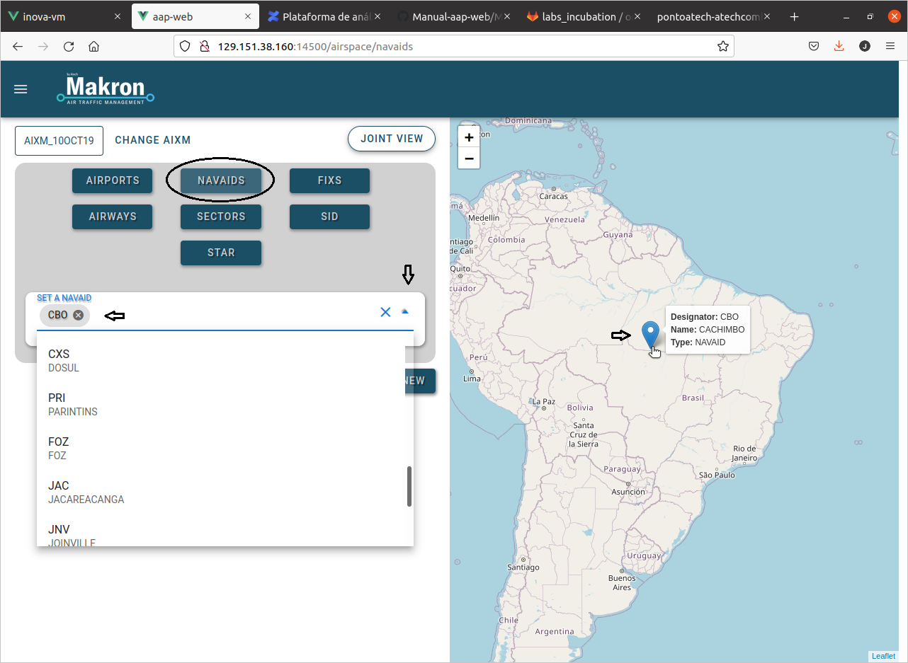

#  Índice

* 1 [Introdução](#intro) 

* 2 [Airspace](#airSpace)

* 2.1 [Inicio](#homeAirspace)

* 2.2 [Principais Comandos](mainCommands)
  
* 3 [Flight Plans](#flightPlans)

* 3.1 [Inicio](#homeFlightplans)

* 4 [Scenarios](#scenarios)

* 4.1 [Inicio](#homeScenarios)

* 5 [Simulation](#simulation)

* 5.1 [Inicio](#homeSimulation)

* 6 [Analysis](#analysis)
  
* 6.1 [Inicio](#homeAnalysis)

* 7 [Comandos Básicos](#basicCommands)

#  1.Introdução

A demonstração da Plataforma de análise de espaço aéreo, segue 5 etapas como mostra a [Figura 1.1](#figViewHome), começando pelo **_Airpace_**.

<figure id="figViewHome">
	
	<figcaption>Fig. 1.1: Visualização da Home. </figcaption>
</figure>

#  2. Airspace

**Objetivo**: Visualização e criação de novos elementos do espaço aéreo, esses elementos poderão ser utilizados posteriormente para a criação de cenários de simulação (**sem regras**), para navegar no Airspace, basta clicar em **ir para a página inicial**, no canto superior direito da página, como mostra a [Figura 2.1](#figViewBotton)

<figure id="figViewBotton">
	
	<figcaption>Fig. 2.1: Visualização Air Space. </figcaption>
</figure>

###  2.1. Home AirSpace

Ao entrar na página inicial do **Airspace**, será exibido um painel de navegação para a _visualização_ e a _adição_ de novos elementos do espaço áereo:

<figure id="figviewAirSpaceDetais">
	
	<figcaption>Fig. 2.1.1.a: Visualização da Home Airspace. </figcaption>
</figure>

####  AIXM

Este botão exibi a versão e data do arquivo AIXM, conforme a figura:

####  Change AIXM

Este botão permite selecionar outro arquivo AIXM, conforme a figura:

<figure id="figviewChangeaixm">
	
	<figcaption>Fig. 2.1.1.b: Visualização da Change AIXM. </figcaption>
</figure>

####  Join View

Este botão permite inserir todos os elementos (**_airports, navaids, fixs, airways, sectors, sid, star_**) para a visualização no mesmo mapa:

<figure id="figviewJoinview">
	
	<figcaption>Fig. 2.1.1.c: Visualização da Join View. </figcaption>
</figure>

####  Airports

Este botão permite a busca e visualização de um aeroporto, e com o botão NEW é possível incluir um novo aeroporto inserindo as informações que serão solicitadas como (**_id, name, lat, lon, type, max rwy lenght, country code e elevation_**), após o preenchimento o usuário pode finalizar a criação do elemento clicando em Submit

<figure id="figviewairport">
	
	<figcaption>Fig. 2.1.1.d: Visualização do Airport. </figcaption>
</figure>

####  Navaids

Este botão permite a visualização no mapa de dispositivo visual ou eletrônico que forneça informações de orientação ponto a ponto ou dados de posição para aeronaves em vôo, e com o botão NEW é possível inserir novo dispositivo inserindo os dados que serão solicitados (**_type, lat, lon, elevation, freq, var id desc_**), após o preenchimento o usuário pode finalizar a criação do elemento clicando em Submit

<figure id="figviewNavaids">
	
	<figcaption>Fig. 2.1.1.e: Visualização do Navaids. </figcaption>
</figure>

####  Fixs
 

<figure id="figviewFixs">
	
	<figcaption>Fig. 2.1.1.f: Visualização da Fixs. </figcaption>
</figure>

####  Airways

####  Sectors

Este botão possibilita a visualização de áreas de controle do espaço aéreo no mapa, e com o botão NEW é possível inserir novas áreas inserindo as informações que serão solicitadas **name, type, uppre limit(fl), lower limit(fl)**, após o preenchimento o usuário pode finalizar a criação do elemento clicando em Submit

<figure id="figviewSectors">
	
	<figcaption>Fig. 2.1.1.g: Visualização dos Sectors. </figcaption>
</figure>

####  Sid e Star
 
<figure id="figviewStar">
	
	<figcaption>Fig. 2.1.1.h: Visualização da Star. </figcaption>
</figure>

#  3. Fligt Plans

###  3.1. Home Flight Plans

**Objetivo** do **Fligt Plans** é criar, editar e deletar planos de vôo que podem ser utilizados posteriormente para criação de cenários de simulação, para visualizar os planos de vôo disponiveis conforme a figura:

<figure id="figViewFlightPlans">
	
	<figcaption>Fig. 3.1.a: Visualização Flight Plans. </figcaption>
</figure>

Para criar ou editar um plano de vôo, clique no botão **create / edit flight** como mostra a [Figura 3.1.a](#figViewFlightPlans) onde será exibido um menu com os planos de vôo cadastrados ou criar ou novo item como mostra a [Figura 3.1.b](#figViewcreate)

<figure id="figViewCreate">
	
	<figcaption>Fig. 3.1.b: Visualização Flight Plans. </figcaption>
</figure>

Para criar um novo plano de vôo, clique no botão **new item** e em seguida preencha as informações que serão solicitadas e finalize clicando em **save**, como mostra a [Figura 3.3](#figViewNewIten)

<figure id="figViewNewIten">
	
	<figcaption>Fig. 3.1.c: Visualização New Iten. </figcaption>
</figure>

#  4. Scenarios

Construção de cenários de vôo.

<figure id="figViewBotton">
	
	<figcaption>Fig. 4.1: Visualização Scenarios. </figcaption>
</figure>

###  4.1. Home Scenarios

#  5. Simulation

Execução da simulação 

<figure id="figViewBotton">
	
	<figcaption>Fig. 5.1: Visualização Simulation. </figcaption>
</figure>

###  5.1. Home Simulation

#  6. Analysis

comparar um cenario de voo com outro cenário

<figure id="figViewBotton">
	
	<figcaption>Fig. 6.1: Visualização Analysis. </figcaption>
</figure>

###  6.1. Home Analysis

